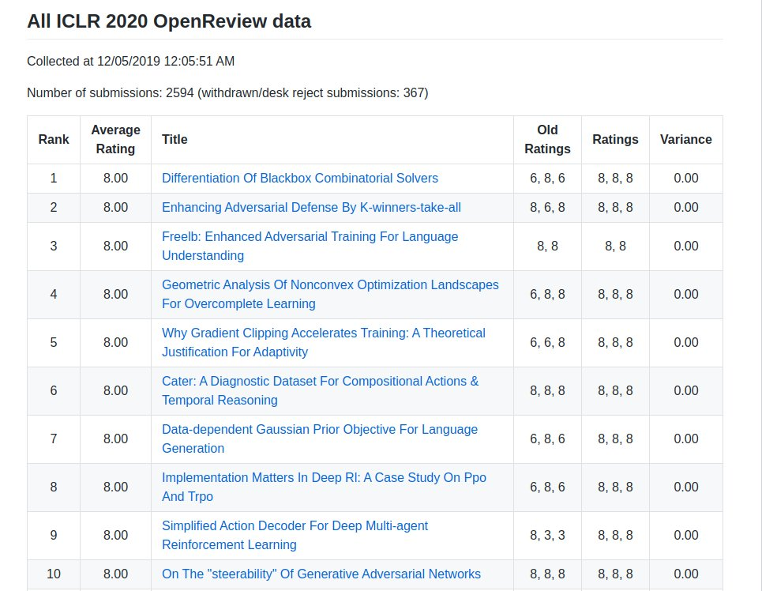

**{{page.venue}}**

Authors: {{ page.authors }}

{{ page.excerpt }}

This paper was among the top rated papers at OpenReview for the entire ICLR 2020 conference.

Links: [Arxiv]({{ page.arxiv_link }}) [OpenReview](https://openreview.net/forum?id=BkevoJSYPB) [Github]({{ page.github_link }}) [Blogpost]({{ page.blog_link}}) [ICLR (video)](https://iclr.cc/virtual_2020/poster_BkevoJSYPB.html)

<blockquote class="twitter-tweet">
Bridging discrete optimization with deep learning. Maybe highly optimized (nondifferentiable) solvers for combinatorial problems will become great again 😍.  Differentiation of Blackbox Combinatorial Solvers <a href="https://t.co/YOzYOYhz20">https://t.co/YOzYOYhz20</a> <a href="https://t.co/N9v6PprYGg">pic.twitter.com/N9v6PprYGg</a>
&mdash; Michal Rolínek (@MichalRolinek) <a href="https://twitter.com/MichalRolinek/status/1203002311292928000?ref_src=twsrc%5Etfw">December 6, 2019</a></blockquote> 

